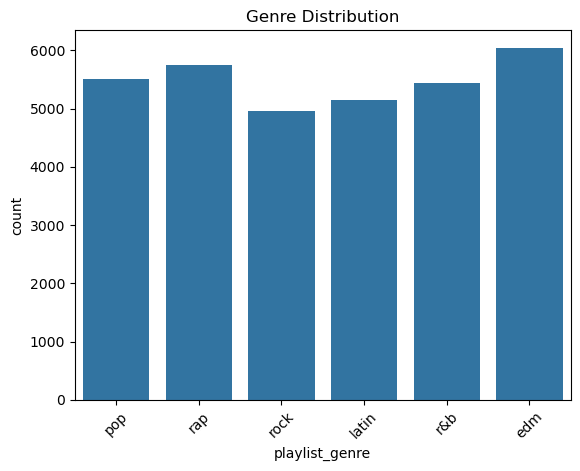
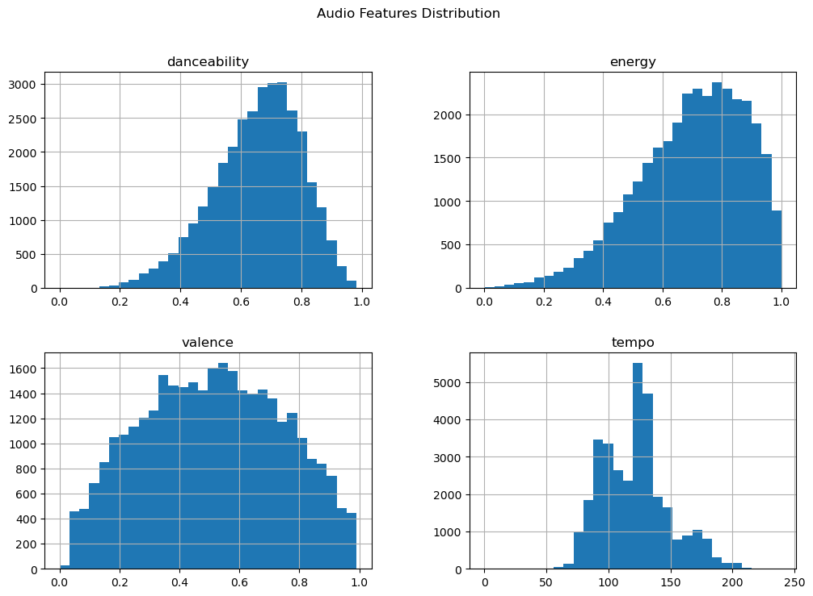
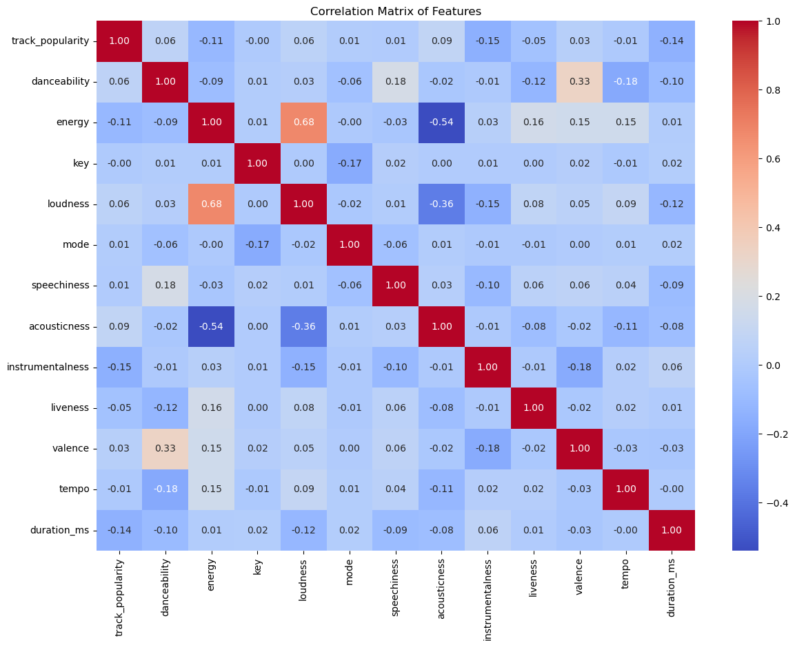
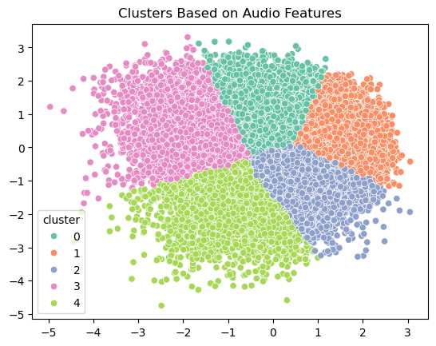

```python
import pandas as pd

df = pd.read_excel('spotify dataset.csv.xlsx')
print(df.head())
```

                     track_id                                         track_name  \
    0  6f807x0ima9a1j3VPbc7VN  I Don't Care (with Justin Bieber) - Loud Luxur...   
    1  0r7CVbZTWZgbTCYdfa2P31                    Memories - Dillon Francis Remix   
    2  1z1Hg7Vb0AhHDiEmnDE79l                    All the Time - Don Diablo Remix   
    3  75FpbthrwQmzHlBJLuGdC7                  Call You Mine - Keanu Silva Remix   
    4  1e8PAfcKUYoKkxPhrHqw4x            Someone You Loved - Future Humans Remix   
    
           track_artist  track_popularity          track_album_id  \
    0        Ed Sheeran                66  2oCs0DGTsRO98Gh5ZSl2Cx   
    1          Maroon 5                67  63rPSO264uRjW1X5E6cWv6   
    2      Zara Larsson                70  1HoSmj2eLcsrR0vE9gThr4   
    3  The Chainsmokers                60  1nqYsOef1yKKuGOVchbsk6   
    4     Lewis Capaldi                69  7m7vv9wlQ4i0LFuJiE2zsQ   
    
                                        track_album_name track_album_release_date  \
    0  I Don't Care (with Justin Bieber) [Loud Luxury...      2019-06-14 00:00:00   
    1                    Memories (Dillon Francis Remix)      2019-12-13 00:00:00   
    2                    All the Time (Don Diablo Remix)      2019-07-05 00:00:00   
    3                        Call You Mine - The Remixes      2019-07-19 00:00:00   
    4            Someone You Loved (Future Humans Remix)      2019-03-05 00:00:00   
    
      playlist_name             playlist_id playlist_genre  ... key  loudness  \
    0     Pop Remix  37i9dQZF1DXcZDD7cfEKhW            pop  ...   6    -2.634   
    1     Pop Remix  37i9dQZF1DXcZDD7cfEKhW            pop  ...  11    -4.969   
    2     Pop Remix  37i9dQZF1DXcZDD7cfEKhW            pop  ...   1    -3.432   
    3     Pop Remix  37i9dQZF1DXcZDD7cfEKhW            pop  ...   7    -3.778   
    4     Pop Remix  37i9dQZF1DXcZDD7cfEKhW            pop  ...   1    -4.672   
    
       mode  speechiness  acousticness  instrumentalness  liveness  valence  \
    0     1       0.0583        0.1020          0.000000    0.0653    0.518   
    1     1       0.0373        0.0724          0.004210    0.3570    0.693   
    2     0       0.0742        0.0794          0.000023    0.1100    0.613   
    3     1       0.1020        0.0287          0.000009    0.2040    0.277   
    4     1       0.0359        0.0803          0.000000    0.0833    0.725   
    
         tempo  duration_ms  
    0  122.036       194754  
    1   99.972       162600  
    2  124.008       176616  
    3  121.956       169093  
    4  123.976       189052  
    
    [5 rows x 23 columns]
    


```python
df.to_csv('clean_spotify.csv', index=False)
```
Data Pre-processing 

```python
df.dropna(inplace=True)
df.drop_duplicates(inplace=True)

df.columns = df.columns.str.strip().str.lower().str.replace(' ', '_')
```

 Data Analysis & Visualizations


```python
import seaborn as sns
import matplotlib.pyplot as plt

sns.countplot(data=df, x='playlist_genre')
plt.xticks(rotation=45)
plt.title('Genre Distribution')
plt.show()
```


    

    


```python
Feature Distributions
```


```python
df[['danceability', 'energy', 'valence', 'tempo']].hist(bins=30, figsize=(12, 8))
plt.suptitle('Audio Features Distribution')
plt.show()
```


    

    


Boxplots for Outliers


```python
sns.boxplot(data=df[['acousticness', 'speechiness', 'instrumentalness']])
plt.title('Outlier Detection in Audio Features')
plt.show()
```


    

    


Correlation Matrix


```python
correlation = df.corr(numeric_only=True)

plt.figure(figsize=(14, 10))
sns.heatmap(correlation, annot=True, cmap='coolwarm', fmt=".2f")
plt.title('Correlation Matrix of Features')
plt.show()
```


    

    


Clustering by Genre / Playlist :

👉 Scale & Reduce :


```python
from sklearn.preprocessing import StandardScaler
from sklearn.decomposition import PCA

features = ['danceability', 'energy', 'valence', 'tempo']
X = df[features]

scaler = StandardScaler()
X_scaled = scaler.fit_transform(X)

pca = PCA(n_components=2)
X_pca = pca.fit_transform(X_scaled)
print(X_scaled[:5])
```

    [[ 0.64199032  1.20163701  0.03193526  0.04291783]
     [ 0.49036132  0.64336218  0.78252071 -0.77728163]
     [ 0.13885773  1.28454912  0.43939593  0.11622427]
     [ 0.4352235   1.27902164 -1.00172814  0.03994394]
     [-0.03344795  0.7428567   0.91977062  0.11503472]]
    

👉 KMeans Clustering


```python
from sklearn.cluster import KMeans

kmeans = KMeans(n_clusters=5, random_state=42)
df['cluster'] = kmeans.fit_predict(X_pca)
print(X_pca[:5]) 
```

    [[ 0.35429747  0.90472068]
     [ 1.06037789  0.43261515]
     [ 0.20490318  1.19784624]
     [-0.40172689  0.48640324]
     [ 0.41010036  1.02544289]]
    

👉 Visualize Clusters


```python
sns.scatterplot(x=X_pca[:,0], y=X_pca[:,1], hue=df['cluster'], palette='Set2')
plt.title('Clusters Based on Audio Features')
plt.show()
print(df['cluster'].value_counts())
print(df[['track_name', 'playlist_genre', 'cluster']].head())
```


    

    


    cluster
    0    7867
    2    7503
    1    6990
    3    6283
    4    4184
    Name: count, dtype: int64
                                              track_name playlist_genre  cluster
    0  I Don't Care (with Justin Bieber) - Loud Luxur...            pop        0
    1                    Memories - Dillon Francis Remix            pop        1
    2                    All the Time - Don Diablo Remix            pop        0
    3                  Call You Mine - Keanu Silva Remix            pop        0
    4            Someone You Loved - Future Humans Remix            pop        0
    

Build the Recommendation System :


```python
print(df.columns.tolist())
```

    ['track_id', 'track_name', 'track_artist', 'track_popularity', 'track_album_id', 'track_album_name', 'track_album_release_date', 'playlist_name', 'playlist_id', 'playlist_genre', 'playlist_subgenre', 'danceability', 'energy', 'key', 'loudness', 'mode', 'speechiness', 'acousticness', 'instrumentalness', 'liveness', 'valence', 'tempo', 'duration_ms', 'cluster']
    


```python
def show_recommendations():
    return recommendations[['track_name', 'playlist_genre']]
```


```python
def recommend_song(df, song_title):
    try:
        df['track_name'] = df['track_name'].astype(str).str.lower().str.strip()
        song_title = song_title.lower().strip()
        
        track_list = df[df['track_name'] == song_title]
        if track_list.empty:
            matches = df[df['track_name'].str.contains(song_title.split()[0])]
            return f"Song not found. Did you mean: {matches['track_name'].unique()[:5]}"
        
        cluster_id = track_list['cluster'].values[0]
        recommendations = df[
            (df['cluster'] == cluster_id) & 
            (df['track_name'] != song_title)
        ]
        
        if recommendations.empty:
            return "No similar songs found in the same cluster."
        
        return recommendations[['track_name', 'track_artist', 'playlist_genre']].sample(
            min(len(recommendations), 5)
        )
    
    except Exception as e:
        return f"Error: {e}"
```


```python
recommend_song(df, 'All the Time - Don Diablo Remix')
```


<div>
<style scoped>
    .dataframe tbody tr th:only-of-type {
        vertical-align: middle;
    }

    .dataframe tbody tr th {
        vertical-align: top;
    }

    .dataframe thead th {
        text-align: right;
    }
</style>
<table border="1" class="dataframe">
  <thead>
    <tr style="text-align: right;">
      <th></th>
      <th>track_name</th>
      <th>track_artist</th>
      <th>playlist_genre</th>
    </tr>
  </thead>
  <tbody>
    <tr>
      <th>24975</th>
      <td>sex me</td>
      <td>H-Town</td>
      <td>r&amp;b</td>
    </tr>
    <tr>
      <th>23626</th>
      <td>i'll do for ya</td>
      <td>Johnnie Floss</td>
      <td>r&amp;b</td>
    </tr>
    <tr>
      <th>30610</th>
      <td>just hold on - dvbbs remix</td>
      <td>Steve Aoki</td>
      <td>edm</td>
    </tr>
    <tr>
      <th>27829</th>
      <td>tear it</td>
      <td>Raven &amp; Kreyn</td>
      <td>edm</td>
    </tr>
    <tr>
      <th>32634</th>
      <td>wake turbulence - david tort remix</td>
      <td>Koen Groeneveld</td>
      <td>edm</td>
    </tr>
  </tbody>
</table>
</div>


